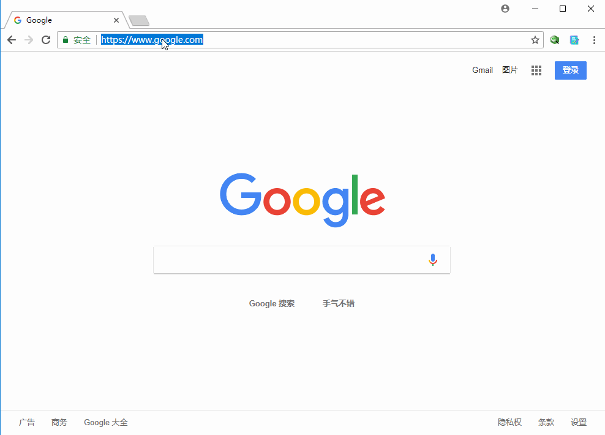

# Webssh

Webssh Server, using ssh2, socket.io, term.js, and express.

## Requirements

Node v8.x or above.

## Instructions

1. Clone to a location somewhere and `npm install`.
2. Edit `sshConfig.js` to change the userinfo.
3. Run `npm start`.
4. Fire up a browser, navigate to IP/port of your choice and specify a host, like: `http://localhost:8080`

## Preview

## enjoy:)